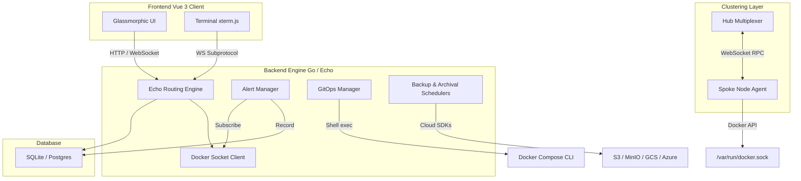
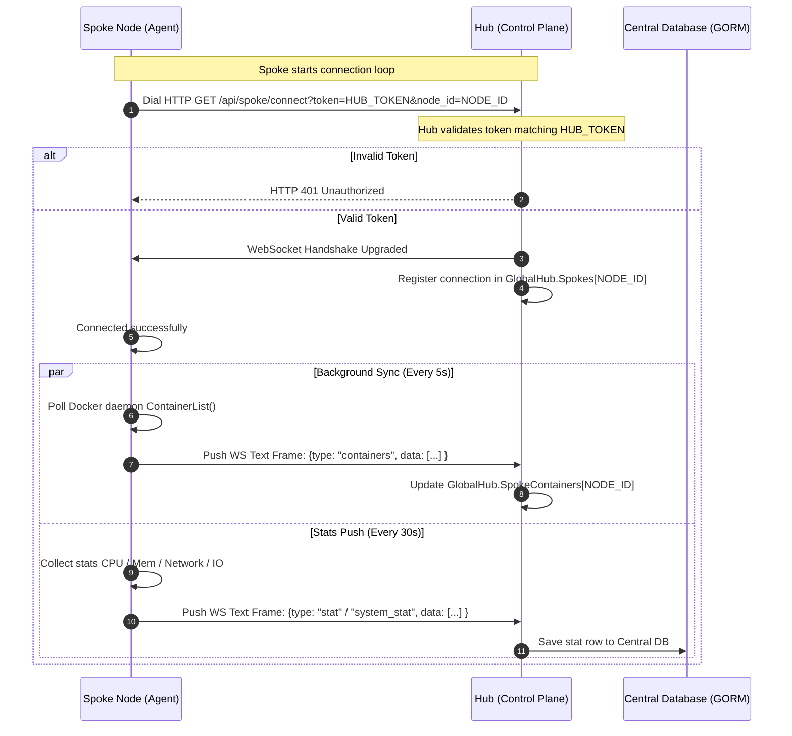
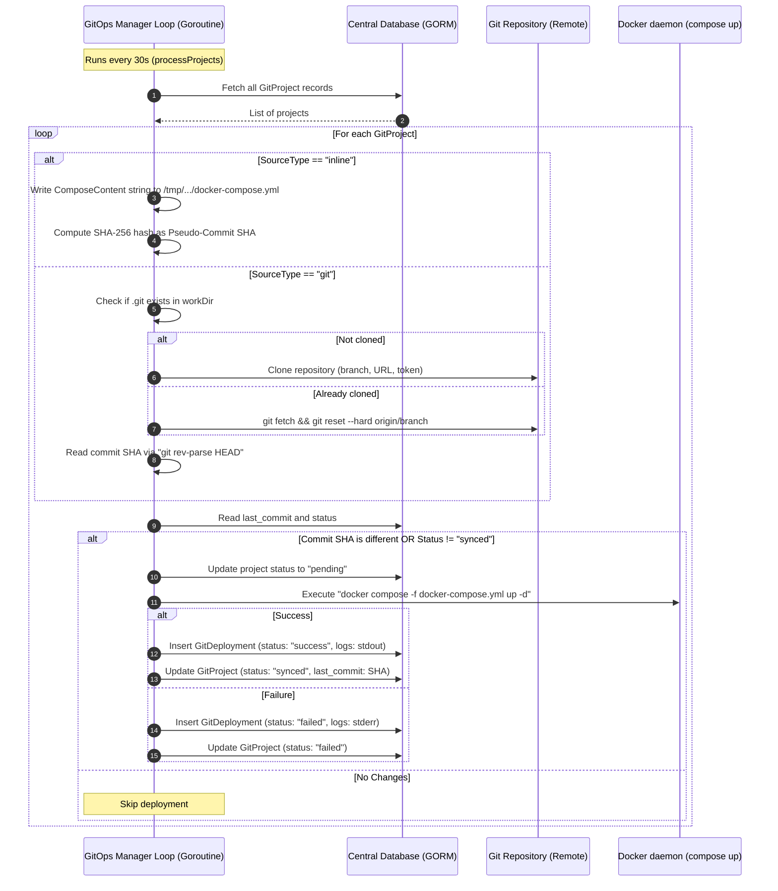
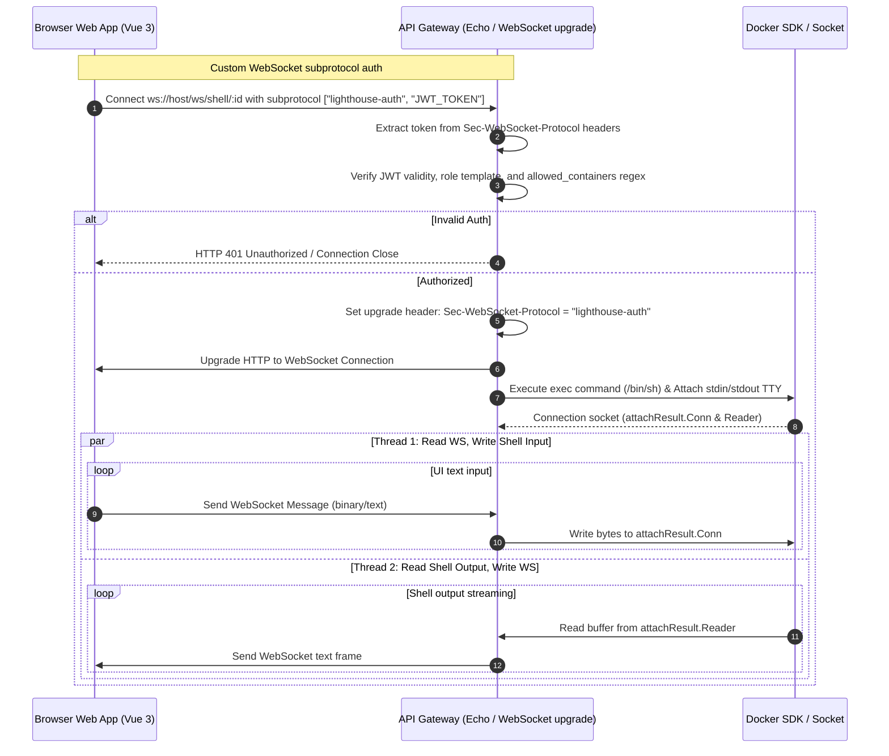

# LightHouse 🐳

<p align="center">
  
</p>

<p align="center">
  <strong>High-performance, real-time Docker log viewer built for teams.</strong>
</p>

<p align="center">
  <a href="https://lighthouses.digital">Official Website</a> | <a href="https://lighthouses.digital/guide">Online Documentation</a>
</p>

<p align="center">
  Lightweight. Secure. Modern. Built for real-world Docker environments.
</p>

<p align="center">
  LightHouse provides real-time log streaming, RBAC, audit logging, system monitoring, Docker container management, and optional Kubernetes visibility in a clean modern interface.
</p>

<p align="center">
  <a href="https://hub.docker.com/r/sharankumar619/lighthouse"></a>
  <a href="https://github.com/sharansutrapu/lighthouse/blob/main/LICENSE"></a>
  
  
  
  <a href="https://github.com/sharansutrapu/lighthouse"></a>
</p>

---

> ⚡ **Average setup time: under 2 minutes.**
> 
> LightHouse focuses on fast deployment, low resource usage, and team-safe Docker visibility without requiring heavyweight observability tooling.

---

# ✨ Core Features

### 🏢 Architecture Options (Standalone vs. Hub & Spoke)
LightHouse is built to scale with your infrastructure, offering two distinct deployment models:
- **Standalone Mode:** Perfect for a single server. Operates with a lightweight, embedded **SQLite** database and requires zero external dependencies.
- **Hub & Spoke Mode:** Designed for distributed environments. Deploy a central **Hub** backed by **PostgreSQL** to manage multiple remote nodes. Lightweight **Spoke** agents run on your worker nodes and establish secure, persistent WebSocket connections back to the Hub, streaming logs and metrics in real-time.

### 🔄 GitOps Auto-Deployments
Manage your Docker infrastructure using modern GitOps practices:
- **Continuous Sync:** Connect GitHub, GitLab, or Bitbucket repositories directly to LightHouse.
- **Automated Deployments:** LightHouse automatically polls for changes and executes `docker compose up -d` whenever your `docker-compose.yml` updates.
- **Private Repositories:** Full support for authentication tokens to securely pull private stacks.
- **Deployment History:** Maintains a complete, easily accessible history of all deployment attempts, sync statuses, and execution logs.

### 🛡️ Vulnerability Scanning (Trivy)
Keep your infrastructure secure with native image scanning:
- **Trivy Integration:** Built-in wrapper for `aquasec/trivy`, the industry standard for container security.
- **Instant Scans:** Scan any running container's image directly from the Container Details dashboard with a single click, or **Scan All** containers at once.
- **Detailed Reporting:** View comprehensive CVE reports, severity badges (Critical, High, Medium, Low), and identify exactly which packages are vulnerable without leaving the UI.

### 🤖 MCP Support (Model Context Protocol)
Supercharge your AI agents with direct access to your Docker infrastructure:
- **Seamless Integration:** Native support for the Model Context Protocol (MCP) using SSE (Server-Sent Events) and stateless message exchanges.
- **Secure Access:** Generate, manage, and revoke dedicated API tokens for your AI assistants directly from the UI.
- **RBAC Enforced:** AI Agents are bound by the exact same Role-Based Access Control (RBAC) and visibility filters as the user who generated their token. An AI cannot see or interact with a container its owner doesn't have access to.
- **Easy Configuration:** Get instant, copy-paste ready `npx` connection commands from the dedicated MCP Configuration panel.
- **AI-Driven DevOps:** Allow your LLMs and agents to query container health, read logs, and trigger deployments safely.

### 🚨 Alerting & Webhooks
Never miss a critical event with the highly customizable Alerting Engine:
- **Extensive Rules:** Comes with 17 default alert rules covering CPU/Memory spikes, container crashes, OOM kills, and more.
- **Resource Thresholds:** Set specific CPU and Memory limits (e.g., alert if CPU > 80% for 5 minutes).
- **Log Pattern Matching:** Trigger alerts when specific Regex patterns or error strings appear in a container's log stream.
- **System & Feature Events:** Trigger notifications on critical platform events like container crashes, OOM kills, Vulnerability Scan results, GitOps deployment status, and database Backup results.
- **Targeted Monitoring:** Apply rules globally, or restrict them to specific containers using Regex names (e.g., `^prod-.*$`).
- **Team-Based Routing:** Configure unique Webhooks and Email addresses per Team. Alerts are intelligently grouped and routed only to the Teams that have visibility of the affected container, drastically reducing noise.
- **SMTP Optimized:** Intelligently groups email recipients into a single CC batch to preserve your SMTP provider limits.
- **Flexible Dispatch:** Instantly route notifications to Slack, Discord, MS Teams, Email, or any custom Webhook endpoint.
- **Spam Prevention:** Built-in cooldown mechanisms ensure your channels aren't flooded during persistent issues.

### 💾 Automated Cloud Backups
Protect your infrastructure configuration and historical metrics with native cloud backups:
- **Multi-Cloud Support:** Seamlessly backup your `lighthouse.db` to AWS S3, MinIO, Google Cloud Storage, or Azure Blob Storage.
- **Cron Scheduling:** Configure precise, automated backup schedules using standard Cron expressions.
- **Compression:** Databases are automatically wrapped into `.tar.gz` archives to save bandwidth and storage space.
- **Zero-Dependency:** Utilizes native provider SDKs so you don't need any external backup daemon or script running on the host.

### 🗄️ Long-Term Storage Archival
Preserve your container lifecycle footprints to remote storage indefinitely, optimizing your local SQLite disk utilization:
- **Metrics & Logs Archival:** Compress and archive container JSONL metrics and `.tar.gz` multiplexed logs.
- **Cloud Providers:** Supports Amazon S3, Google Cloud Storage, and Azure Blob Storage integrations.
- **Independent Schedulers:** Driven by `robfig/cron/v3`, running independently of system backups. 

### 📜 Real-Time Logs & 💻 Interactive Shell
Unparalleled visibility and control over your running containers:
- **Live Log Streaming:** Lightning-fast WebSocket log streaming with infinite scroll, manual history loading, and smart auto-scroll.
- **Search & Highlighting:** Powerful regex-based search with real-time text highlighting and safe HTML rendering.
- **Interactive Terminal:** Open a secure, fully interactive bash/sh shell inside any container directly from your browser—no SSH required.
- **Subprotocol Auth:** Both logs and shell sessions are secured via WebSocket JWT subprotocol authentication, preventing token leakage.

### 🔐 Advanced RBAC & Audit Logs
Enterprise-grade security controls to keep your team and infrastructure safe:
- **Multi-Team Management:** Organize users into logical Teams and map multiple Teams to environments, users, or projects seamlessly.
- **Granular Permissions:** Assign specific operational rights to users, including `Start`, `Stop`, `Restart`, `Delete`, and `Shell` access.
- **Regex-Based Visibility:** Restrict which containers a user can see or manage using wildcards (`backend-*`) or full regular expressions (`^prod-.*$`).
- **BOLA Protection:** Robust Broken Object Level Authorization (BOLA) defenses ensure that users can only access endpoints and actions authorized for their assigned containers and GitOps projects.
- **Complete Audit Trails:** Every administrative action, shell session, and container operation is permanently recorded in the Audit Logs, tracking exactly *who* did *what* and *when*.
- **Single Sign-On (SSO):** Authenticate using Google OAuth securely.
- **Automated Validation:** The platform is rigorously tested with an automated End-to-End validation suite (`e2e_validator.py`) to prevent regressions in security policies and critical path APIs.

---

# 📸 Preview

## 📊 Dashboard
Real-time Docker monitoring with lightweight system metrics and container controls across your entire cluster.

## 🐳 Container Management & GitOps
Monitor, control, and deploy containers with fast operational actions. Connect Git repositories to track deployment history and sync states.

## 📜 Real-Time Logs & Shell
Stream container logs live with search, highlighting, and auto-scroll. Access secure, fully interactive bash shells inside containers.

## 🛡️ Security & Audits
Run deep vulnerability scans on running images, manage granular RBAC policies, and view complete audit trails of all actions.

---

# 🛠 Tech Stack

| Layer            | Technology                |
| ---------------- | ------------------------- |
| Backend          | Go + Echo                 |
| Frontend         | Vue 3 + Vite              |
| ORM / Database   | GORM (PostgreSQL & SQLite)|
| Streaming        | WebSockets                |
| Container Engine | Docker SDK (Moby)         |

---

# ⚙️ Configuration & Environment Variables

LightHouse reads several environment variables to configure its runtime behavior:

| Environment Variable | Default Value | Available Options | Description |
| :--- | :--- | :--- | :--- |
| **`LIGHTHOUSE_MODE`** | `standalone` | `standalone`, `hub`, `spoke` | The node operational mode. |
| **`NODE_NAME`** | *Hostname* | Any unique string | Unique identifier for the node (used in metrics partitioning). |
| **`DB_TYPE`** | `sqlite` | `sqlite`, `postgres` | The database engine type. |
| **`DB_DSN`** | *None* | Connection URL string | The database connection string (DSN) for PostgreSQL or SQLite. |
| **`DB_PATH`** | `/app/data/lighthouse.db` | Directory path or `:memory:` | The path to the SQLite file. Falls back to `:memory:` if auth is disabled. |
| **`PORT`** | `8000` | Any port number | The network serving port. |
| **`SECRET_KEY`** | `secret-key-change-this`| Any secure string | The signing key for JWT tokens. **Must be changed in production.** |
| **`CLIENT_ACCESS`** | `strict` | `strict`, `off` | Enforces CORS Origin header validation for clients. |
| **`ALLOWED_ORIGINS`**| *None* | Comma-separated domains | Allowed Origin domains for CORS checks. |
| **`TRUST_PROXY`** | `false` | `true`, `false` | Trust incoming `X-Forwarded-Host`/`Proto` headers. |
| **`ALLOW_START`** | `false` | `true`, `false` | Global setting to allow starting containers. |
| **`ALLOW_STOP`** | `false` | `true`, `false` | Global setting to allow stopping containers. |
| **`ALLOW_RESTART`** | `false` | `true`, `false` | Global setting to allow restarting containers. |
| **`ALLOW_DELETE`** | `false` | `true`, `false` | Global setting to allow removing containers. |
| **`ALLOW_SHELL`** / **`ALLOW_BASH`**| `false` | `true`, `false` | Global setting to allow terminal shell access. |
| **`EXCLUDE_CONTAINERS`** | *None* | Comma-separated list | List of container names to hide from the dashboard. |
| **`HUB_URL`** | *None* | Host endpoint address | The WebSocket endpoint of the Hub (required for Spokes). |
| **`HUB_TOKEN`** | *None* | Secure token string | Shared authorization token (required for Spokes and Hub). |

*(Note: The LightHouse container itself is always hidden from the dashboard)*

---

# 🚀 Deployment

## Standalone (SQLite)
The quickest way to get started on a single node:

```yaml
version: '3.8'
services:
  lighthouse:
    image: sharankumar619/lighthouse:latest
    container_name: lighthouse
    restart: unless-stopped
    ports:
      - "8000:8000"
    volumes:
      - /var/run/docker.sock:/var/run/docker.sock
      - lighthouse-data:/app/data
    environment:
      - SECRET_KEY=generate-a-secure-random-string
      - DB_TYPE=sqlite
      - DB_PATH=/app/data/lighthouse.db

volumes:
  lighthouse-data:
```

## Hub & Spoke (PostgreSQL)

**1. Deploy the Hub**
```yaml
version: '3.8'
services:
  lighthouse-hub:
    image: sharankumar619/lighthouse:latest
    environment:
      - LIGHTHOUSE_MODE=hub
      - DB_TYPE=postgres
      - DB_DSN=host=db user=lighthouse password=secure dbname=lighthouse port=5432 sslmode=disable
      - SECRET_KEY=your-secure-secret
```

**2. Deploy a Spoke on a target node**
```yaml
version: '3.8'
services:
  lighthouse-spoke:
    image: sharankumar619/lighthouse:latest
    environment:
      - LIGHTHOUSE_MODE=spoke
      - HUB_URL=ws://hub-address.com
      - HUB_TOKEN=generated-spoke-token
    volumes:
      - /var/run/docker.sock:/var/run/docker.sock
```

---

# 🔐 First Login
By default, LightHouse creates an administrator account on first boot:
- **Username:** `admin`
- **Password:** `admin123`

*You will be forced to change this password immediately upon logging in.*

---

## Architecture & Lifecycle Deep Dive

### 🏗️ Micro-Architecture


### 📡 Spoke Node connecting to the Hub
This sequence diagram illustrates the spoke registration handshake, heartbeat loop, and multiplexed data synchronization channels.



### 🔄 GitOps Commit Hook & Polling Lifecycle
This sequence diagram shows the step-by-step process of project synchronization, code compilation, and Docker Compose deployment.



### 💻 Live Log & Shell Request Lifecycle
This sequence diagram illustrates the lifecycle of a real-time terminal shell session running inside a target container.



