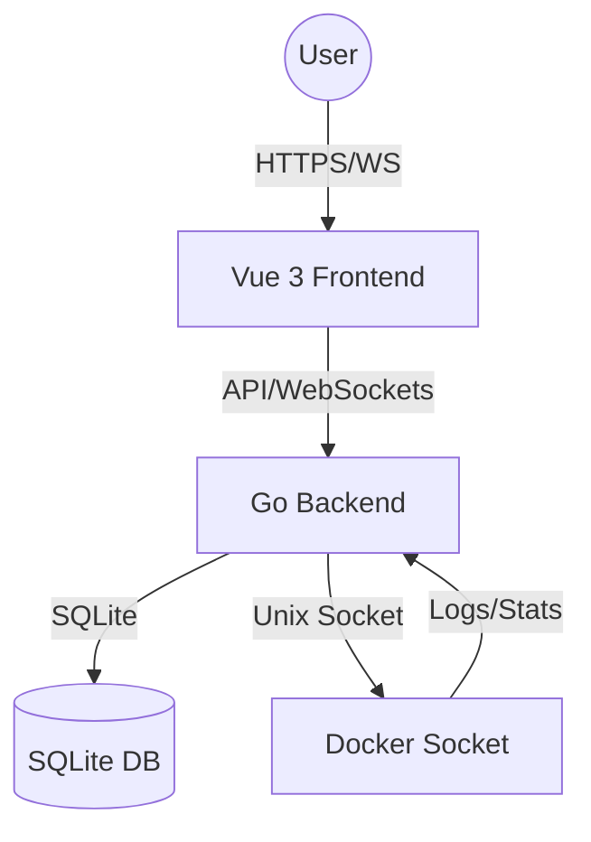

# Architecture Overview

LightHouse is designed as a lightweight, secure bridge between teams and the Docker daemon.

## 🏗 High-Level Architecture

### 1. The Backend (Go)
The backend is the core of the application. It handles:
- **Authentication**: JWT-based auth with `SECRET_KEY` signing, and OAuth 2.0 integrations (Google).
- **RBAC Enforcement**: Middleware that validates every request against user permissions stored in SQLite.
- **Docker Interaction**: Communicates with the local Docker daemon via the standard Moby SDK.
- **Real-time Streaming**: Efficiently tails Docker logs and streams them to the client via WebSockets.
- **GitOps Management**: Clones remote Git repositories and orchestrates deployments using `docker compose` in isolated workspaces.
- **Security Scanning**: Integrates with Trivy to execute localized image vulnerability scans directly against the Docker daemon.

### 2. The Frontend (Vue 3)
A modern Single Page Application (SPA) that provides:
- **Dashboard**: Real-time log viewer and container management.
- **Admin Panel**: Interface for managing users, permissions, and viewing audit logs.
- **Security**: Enforces password changes and hides unauthorized actions.

### 3. Data Storage (SQLite)
A local `lighthouse.db` file stores:
- **User Accounts**: Credentials (hashed) and permission profiles.
- **Audit Logs**: Every administrative and container action is recorded for traceability.
- **Container Stats**: Historical performance data (CPU/Memory).

## 🔐 Security Model

LightHouse uses a "Defense in Depth" approach:
1.  **Transport Security**: Should be deployed behind a reverse proxy (like Nginx or Traefik) for TLS.
2.  **Authentication**: Every request requires a valid JWT.
3.  **Authorization**: Even with a valid token, the backend re-validates permissions for the specific resource (container) on every request.
4.  **Audit Trail**: Every action is logged, creating a permanent record of who did what and when.
