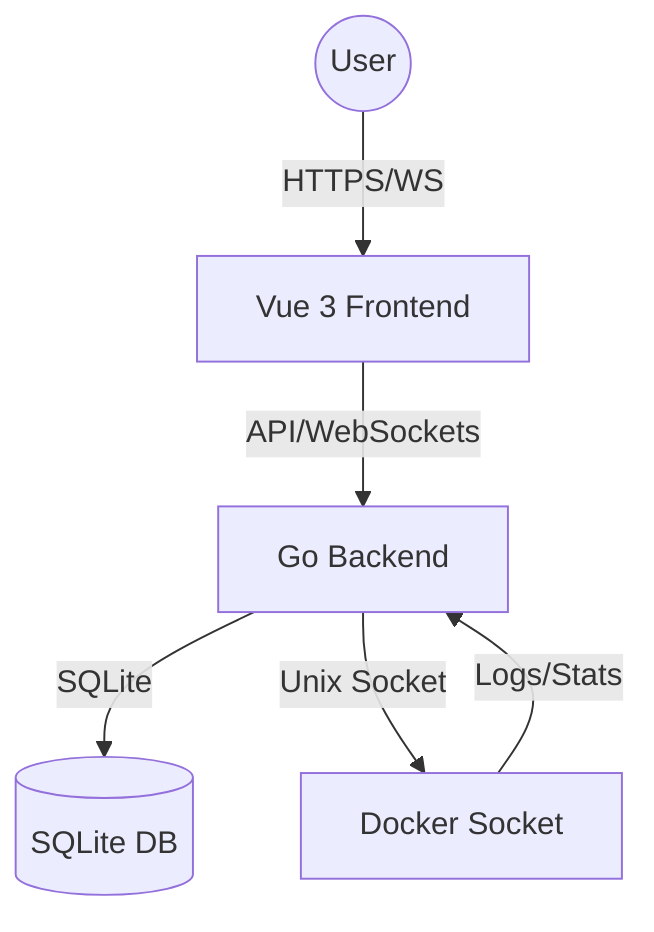
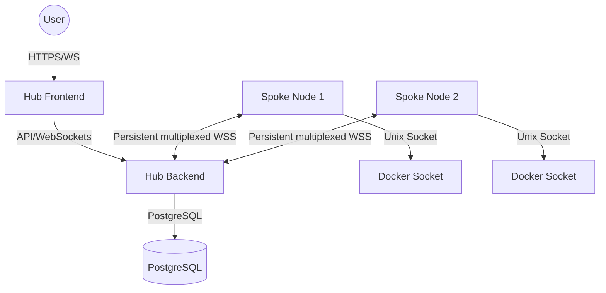

# Architecture Overview

LightHouse is designed as a lightweight, secure bridge between teams and the Docker daemon.

## 🏗 High-Level Architecture

LightHouse supports two distinct deployment models to fit your infrastructure:

### Standalone Mode
Ideal for single-server setups. Everything runs in one lightweight process.

```mermaid
graph TD
    User((User)) -->|HTTPS/WS| FE[Vue 3 Frontend]
    FE -->|API/WebSockets| BE[Go Backend]
    BE -->|SQLite| DB[(SQLite DB)]
    BE -->|Unix Socket| DS[Docker Socket]
    DS -->|Logs/Stats| BE
```

### Hub & Spoke Mode
Designed for distributed environments. A central Hub manages multiple remote Nodes (Spokes).

```mermaid
graph TD
    User((User)) -->|HTTPS/WS| HubFE[Hub Frontend]
    HubFE -->|API/WebSockets| HubBE[Hub Backend]
    HubBE -->|PostgreSQL| HubDB[(PostgreSQL)]
    
    Spoke1[Spoke Node 1] <-->|Persistent multiplexed WSS| HubBE
    Spoke2[Spoke Node 2] <-->|Persistent multiplexed WSS| HubBE
    
    Spoke1 -->|Unix Socket| DS1[Docker Socket]
    Spoke2 -->|Unix Socket| DS2[Docker Socket]
```

#### Topology-aware API and UI

In hub mode, `GET /api/config` identifies the runtime `mode` and local
`node_id`. Each `GET /api/containers` item includes its `node_id`, whether it
is remote, and explicit capabilities for inspect, logs, shell, statistics,
actions, and scanning. The frontend uses these fields to group and filter the
fleet by node and to avoid presenting unsupported operations as working.

Administrators can inspect current node connection state through
`GET /api/admin/nodes` and the hub-only **Nodes** view. The view reports the
hub, connected spokes, recently disconnected spokes, last-seen timestamps,
and workload counts.

Remote spoke workloads provide inventory, inspection, live logs, interactive
shells, lifecycle actions, and vulnerability scans through the hub. Image,
volume, and network lists are aggregated across connected nodes; each resource
retains its owning `node_id`, and destructive operations are sent only to the
selected node. Per-container live-stat charts remain local-only, while metric
samples pushed by spokes are available to hub-level history and health views.
GitOps execution remains local to the hub. Standalone mode retains the existing
single-host interface.

#### Control protocol

Each spoke opens one outbound authenticated WebSocket to the hub. The
connection multiplexes inventory and metric events, correlated request/response
RPC, log streams, and terminal streams:

- RPC messages carry a generated `request_id`; the HTTP request succeeds only
    after the spoke reports Docker's result or fails on timeout/disconnect.
- Log and terminal messages carry independent `stream_id` or `exec_id` values,
    allowing concurrent browser sessions over the same spoke connection.
- Terminal input received while Docker creates the exec attachment is buffered,
    and disconnecting either side cancels the Docker stream.
- Upgraded spokes announce protocol capabilities on connect. During a hub-first
    rollout, legacy spokes remain available for inventory, metrics, and logs;
    RPC, shell, and remote resource controls appear only after that spoke is
    upgraded.
- Spokes authenticate with `Authorization: Bearer <HUB_TOKEN>`. Query-token
    authentication is retained only for compatibility during rolling upgrades.

Upgrade the hub first, then upgrade each spoke. The newer hub accepts the
previous spoke handshake while spokes are replaced; spoke-first upgrades are
not guaranteed to be understood by an older hub.

### 1. The Backend (Go)
The backend is the core of the application. It handles:
- **Authentication**: JWT-based auth with `SECRET_KEY` signing, and OAuth 2.0 integrations (Google SSO).
- **RBAC Enforcement**: Middleware that validates every request against user permissions stored in the database.
- **Docker Interaction**: Communicates with the local Docker daemon via the standard Moby SDK.
- **Real-time Streaming**: Efficiently tails Docker logs and streams them to the client via WebSockets.
- **GitOps Management**: Clones remote Git repositories and orchestrates deployments using `docker compose` in isolated workspaces.
- **Security Scanning**: Integrates with Trivy to execute localized image vulnerability scans directly against the Docker daemon.
- **Alerting Engine**: Monitors container health and logs, dispatching alerts to webhooks and email based on customizable rules.
- **Cloud Backups**: Natively pushes scheduled `lighthouse.db` backups to AWS S3, Google Cloud Storage, or Azure Blob Storage.
- **Log Archival**: Compresses and archives container log streams to cold cloud storage.
- **MCP Server (AI Integration)**: Serves a Model Context Protocol server over HTTP Server-Sent Events (SSE) to allow AI agents secure, RBAC-filtered access to Docker operations.

### 2. The Frontend (Vue 3)
A modern Single Page Application (SPA) that provides:
- **Dashboard**: Real-time log viewer and container management.
- **Admin Panel**: Interface for managing users, permissions, and viewing audit logs.
- **Security**: Enforces password changes and hides unauthorized actions.

### 3. Data Storage (SQLite & PostgreSQL)
Depending on your deployment mode, LightHouse uses either a local `lighthouse.db` (SQLite) or a centralized PostgreSQL database to store:
- **User Accounts**: Credentials (hashed) and permission profiles.
- **Audit Logs**: Every administrative and container action is recorded for traceability.
- **Container Stats**: Historical performance data (CPU/Memory).
- **GitOps Projects**: Repository configuration and sync history.
- **Alerting Rules**: Definitions for when to trigger notifications.
- **API Keys (MCP)**: Dedicated credentials used by AI agents to establish secure MCP sessions. Only a SHA-256 hash of each token is persisted; the plaintext is shown once at creation and never stored.

## 🔐 Security Model

LightHouse uses a "Defense in Depth" approach:
1.  **Transport Security**: Should be deployed behind a reverse proxy (like Nginx or Traefik) for TLS.
2.  **Authentication**: Every request requires a valid JWT.
3.  **Authorization**: Even with a valid token, the backend re-validates permissions for the specific resource (container) on every request.
4.  **Audit Trail**: Every action is logged, creating a permanent record of who did what and when.
